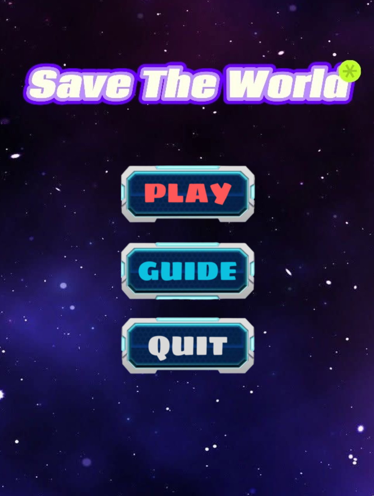
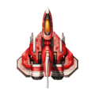
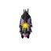

# Save The World
## Giới thiệu bản thân:
- Họ và tên: Nguyễn Đức Huy
- Mã Sinh Viên: 24020162
- Lớp: IT9 - K69
- Mã học phần: INT2215-3
## Thử nghiệm game:
- [Demo Game] (link_)
## Giới thiệu game
**Save The World** là 1 game thuộc thể loại hành động. Game sẽ cho người chơi điều khiển 1 chiếc máy bay chiến đấu để bắn hạ kẻ địch xuất hiện trên màn hình. Dòng game đòi hỏi có lối chơi nhanh, phản xạ tốt. Nếu người chơi chạm vào kẻ địch thì sẽ bị mất 1 sinh mạng. Nếu hết sinh mạng thì game sẽ kết thúc. Nếu bắn hết kẻ địch thì người chơi sẽ chiến thắng. Trong game còn có các chức năng tăng sinh mạng và nâng cấp đạn cho máy bay người chơi.  
### 1. Bắt đầu game
Ở màn hình Menu có 3 nút **"PLAY"**, **"GUIDE"**, **"QUIT"**
- Khi nhấn vào nút **"PLAY"** game sẽ bắt đầu
- Khi nhấn vào nút **"GUIDE"** sẽ hiện ra hướng dẫn chơi game cho người chơi
- Khi nhấn vào nút **"QUIT"** sẽ thoát chương trình game

### 2. Các thành phần trong game
- **Plane (Người chơi):**  là đối tượng chính của trò chơi
- **Background (Nền phía sau):** 
là hình ảnh nền tạo nên 1 không gian thú vị cho người chơi
- **Máy bay kẻ địch:**   được coi là chướng ngại vật, kẻ thù của máy bay do người chơi điều khiển
- **Đạn:**  là một chức năng của máy bay chiến đấu dùng để bắn hạ kẻ địch
- **Sinh mệnh:**  là một chức năng giúp cho máy bay chiến đấu tăng sinh mệnh, tăng cơ hội sống xót
- **Đạn đôi:**  là một chức năng giúp cho máy bay tăng sức mạnh, bắn ra 2 viên đạn cùng 1 lúc
- **Điểm số:**  hiển thị điểm số của người chơi khi bắn trúng kẻ địch. Bắn trúng mỗi kẻ địch sẽ được cộng 5 điểm  
### 3. Cách chơi
Người chơi sẽ sử dụng các phím mũi tên **Phải**, **Trái**, **Lên**, **Xuống** trên bàn phím để di chuyển máy bay chiến đấu. Sử dụng phím **SPACE** trên bàn phím để đạn được bắn ra. Nếu đạn được bắn trúng kẻ địch thì địch sẽ biến mất khỏi màn hình và số điểm của bạn sẽ được cộng thêm 5 điểm. Người chơi phải di chuyển và bắn đạn khéo léo sao cho máy bay người chơi không được chạm vào kẻ địch và tích được nhiều điểm số nhất có thể. Nếu chạm vào sẽ bị trừ 1 sinh mạng, có tối đa 5 sinh mạng, khi sinh mạng về 0 thì người chơi sẽ thua cuộc. Trong quá trình chơi còn có các bài chức năng tăng sinh mạng và nâng cấp đạn cho máy bay để game tăng phần kịch tính. Khi người chơi ăn được bài sinh mạng thì sinh mạng sẽ được tăng lên 1, khi người chơi ăn bài nâng cấp đạn thì máy bay sẽ bắn ra 2 viên đạn cùng 1 lúc. Đến cuối game người chơi vẫn còn sinh mạng thì người chơi sẽ chiến thắng và game kết thúc
## Source code game

## Đánh giá
### Ưu điểm
- Di chuyển khá mượt mà, các hiệu ứng trong game được xử lý hiệu quả, trong game có các chức năng và phương thức cộng điểm để không gây nhàm chán cho người chơi
### Nhược điểm
- Trò chơi còn khá đơn điệu
- Các chức năng trong game còn khá sơ sài
- Chưa có nhiều map
- Các vị trí của kẻ địch trên map chỉ là vị trí cụ thể được cài đặt sẵn 
### Phát triển
- Load thêm nhiều map để tạo nhiều màn cho trò chơi
- Thêm nhiều chức năng để tạo sự thú vị cho trò chơi
- Tạo thêm BOSS vào cuối game tạo sự kịch tính cho trò chơi
- Nâng cấp các kẻ địch để có thế di chuyển đa hướng thay vì di chuyển thẳng
